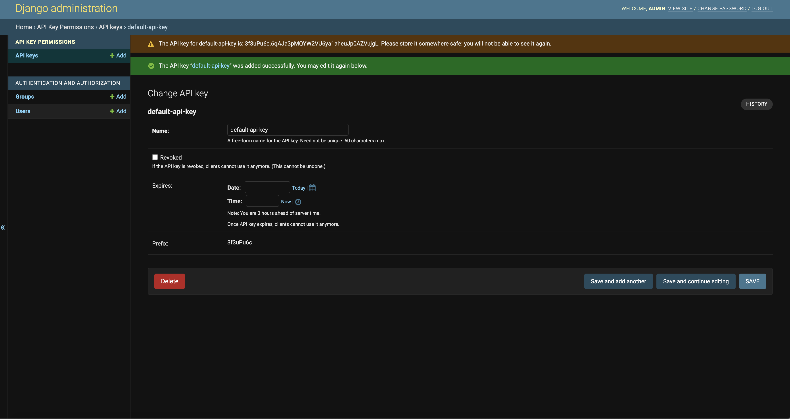
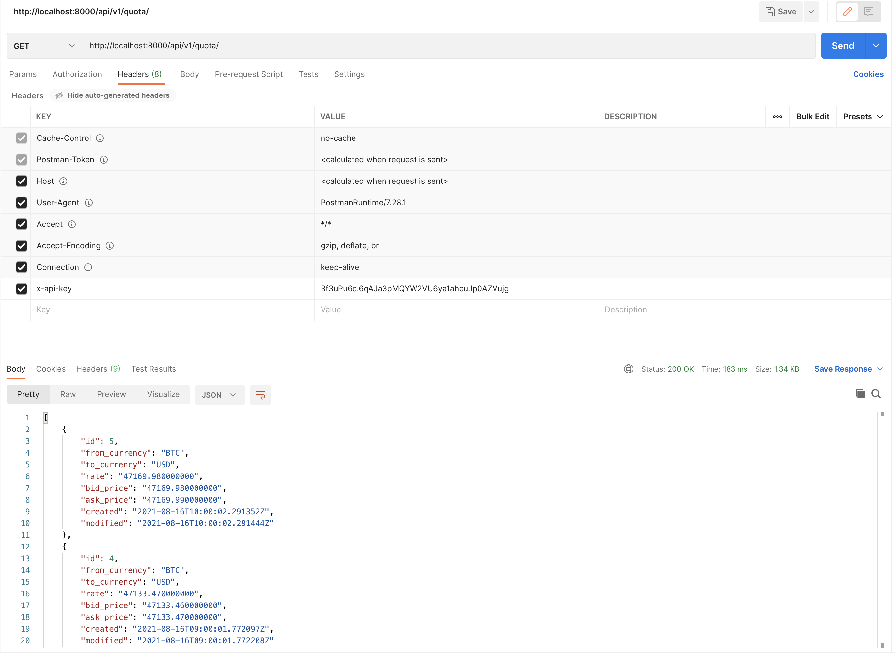

<h1>Overview</h1>
Simple django application to fetch last BTC/USD exchange rate

<h1>Setup</h1>

- change `CRYPTO_PROVIDER_API_KEY`  value in web-variables.env file you can get it for free from this link :https://www.alphavantage.co/support/#api-key 

<h1>How to use</h1>

- Run command `docker-compose up --build`
- Access the web instance shell using command `docker-compose exec web bash` 
    - crate super user using command `python manage createsuperuser `
- After creating the super user navigate to http://0.0.0.0:8000/admin/ and create api key

    
    Note: the api key will be shown in the message at the header after creating the api model
    
- Set the api key in the `x-api-key` header to use the api
  
  
  
<h1>Application APIs</h1>

- [GET] api/v1/quota/
    - return by default list of btc/usd exchange rates ordered by creation date
    - the last price will be the first item in the list
- [POST]  api/v1/quota/
    - force to fetch latest quota and return by default list of btc/usd exchange rates ordered by creation date

<h1>Enhancements</h1>

- Making the quota api dynamic to accept currency pairs 
- Create encrypted secret file to save sensitive data using git-secret 

